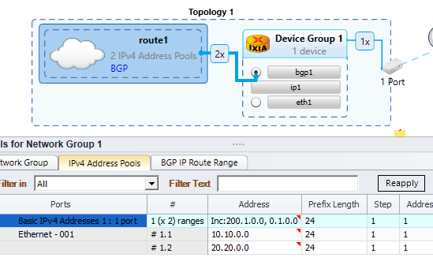
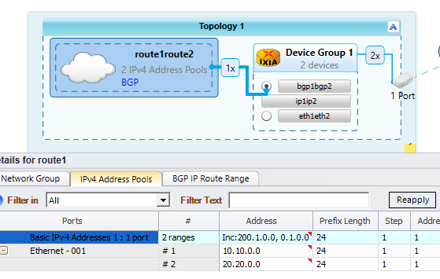
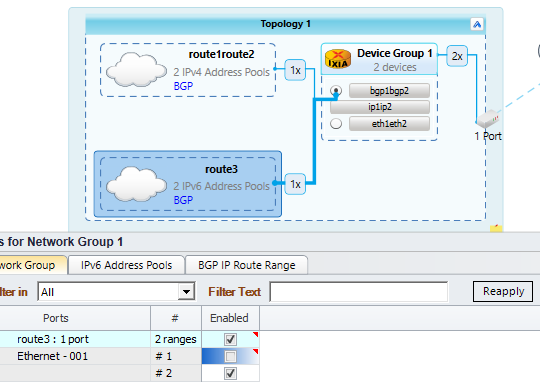
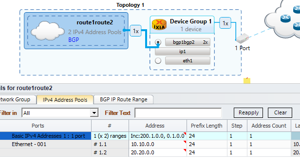
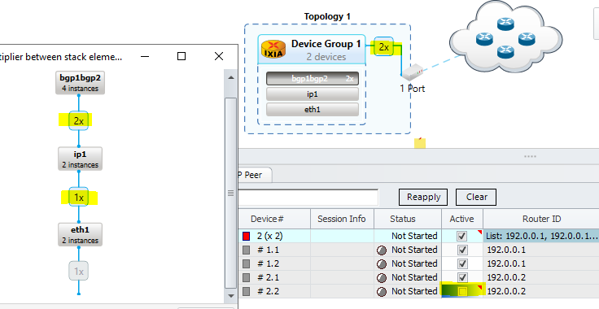

# Scenario-1: Simple BGP and Route
```python
device = config.devices.device(name="d1")[-1]
eth = device.ethernets.ethernet(name='eth1', port_name="p1")[-1]
eth.ipv4_addresses.ipv4(name="ip1")

bgp = device.bgp
bgp.router_id = "10.10.0.1"
bgp_int = bgp.ipv4_interfaces.add(ipv4_name="ip1")
bgp_peer = bgp_int.peers.add(name="bgp1")
bgp_peer.peer_address = "10.10.0.2"
bgp_peer.as_type = bgp_peer.IBGP
bgp_peer.as_number = 2
v4_routes = bgp_peer.v4_routes.add(name="route1")
v4_routes.addresses.add(address="10.10.0.0")
v4_routes = bgp_peer.v4_routes.add(name="route2")
v4_routes.addresses.add(address="20.20.0.0")
```
- Single ethernet(“eth1”) configurate on top of port “p1”
- Single IPv4(“ip1”) present on top of ethernet(“eth1”)
- Single BGP map with IPv4(“ip1”)
- Two v4_route configure on that bgp_peer
## IxNetwork Mapping


- Create topology per port
- Ether, IP and BGP can map one to one
- Create network group (NG) according to v4_routes
- Use NG multiplier to accommodate number of address

# Scenario-2: Multiple devices configured top of same Port
```python
device1 = config.devices.device(name="d1")[-1]
device2 = config.devices.device(name="d2")[-1]

eth1 = device1.ethernets.ethernet(name='eth1', port_name="p1")[-1]
eth1.vlans.add(name="vlan1", id=1)
eth2 = device2.ethernets.ethernet(name='eth2', port_name="p1")[-1]
eth2.vlans.add(name="vlan2", id=2)
eth1.ipv4_addresses.ipv4(name="ip1")
eth2.ipv4_addresses.ipv4(name="ip2")

bgp1 = device1.bgp
bgp1.router_id = "1.1.1.1"
bgp_int1 = bgp1.ipv4_interfaces.add(ipv4_name="ip1")
bgp_peer1 = bgp_int1.peers.add(name="bgp1")
v4_routes1 = bgp_peer1.v4_routes.add(name="route1")
v4_routes1.addresses.add(address="10.10.0.0")

bgp2 = device2.bgp
bgp2.router_id = "1.1.1.2"
bgp_int2 = bgp2.ipv4_interfaces.add(ipv4_name="ip2")
bgp_peer2 = bgp_int2.peers.add(name="bgp2")
v4_routes2 = bgp_peer2.v4_routes.add(name="route2")
v4_routes2.addresses.add(address="20.20.0.0")
```
- Two device configured on top of same port ("p1")
- Different VLAN segregate BGP Peer
- Two BGP peers map with Two interface 
## IxNetwork Mapping


- Add device multiplier ("2") according to the number of device
- Compact all values related to Ethernet, IP and BGP. And configure those in respective rows
- Different router ID should configure
- Stack Multiplier should be 1 for all those stack

# Scenario-3: Multiple Interface and BGP 
```python
device = config.devices.device(name="d1")[-1]
eth1 = device.ethernets.ethernet(name='eth1', port_name="p1")[-1]
eth2 = device.ethernets.ethernet(name='eth2', port_name="p1")[-1]
eth1.ipv4_addresses.ipv4(name="ip1")
eth2.ipv4_addresses.ipv4(name="ip2")

bgp = device.bgp
bgp.router_id = "1.1.1.1"
bgp_int1 = bgp.ipv4_interfaces.add(ipv4_name="ip1")
bgp_peer1 = bgp_int1.peers.add(name="bgp1")
v4_routes = bgp_peer1.v4_routes.add(name="route1")
v4_routes.addresses.add(address="10.10.0.0")
bgp_int2 = bgp.ipv4_interfaces.add(ipv4_name="ip2")
bgp_peer2 = bgp_int2.peers.add(name="bgp2")
v4_routes = bgp_peer2.v4_routes.add(name="route2")
v4_routes.addresses.add(address="20.20.0.0")
```
- Two interfaces on top of single port
- Two BGP peers map with Two interface 
## IxNetwork Mapping


- Add device multiplier ("2") according to the number of interfaces
- Compact all values related to Ethernet, IP and BGP. And configure those in respective rows
- Same router ID should configure
- Stack Multiplier should be 1 for all those stack

# Scenario-4: Single BGP and multiple Route Addresses
```python
device = config.devices.device(name="d1")[-1]
eth = device.ethernets.ethernet(name='eth1', port_name="p1")[-1]
eth.ipv4_addresses.ipv4(name="ip1")

bgp = device.bgp
bgp.router_id = "10.10.0.1"
bgp_int = bgp.ipv4_interfaces.add(ipv4_name="ip1")
bgp_peer = bgp_int.peers.add(name="bgp1")
v4_routes = bgp_peer.v4_routes.add(name="route1")
v4_routes.addresses.add(address="10.10.0.0")
v4_routes.addresses.add(address="20.20.0.0")
```
- Best practice to configure multiple routes.
- Anyway as model is supporting, we configured two addresses within same route

## IxNetwork Mapping


- Create a Network group (NG) with multiplier 2
- We need to configured all route related properties("v4_routes") within two BGP Route range

# Scenario-5: Multiple devices with multiple different routes 
```python
device1 = config.devices.device(name="d1")[-1]
device2 = config.devices.device(name="d2")[-1]

eth1 = device1.ethernets.ethernet(name='eth1', port_name="p1")[-1]
eth2 = device2.ethernets.ethernet(name='eth2', port_name="p1")[-1]
eth1.ipv4_addresses.ipv4(name="ip1")
eth2.ipv4_addresses.ipv4(name="ip2")

bgp1 = device1.bgp
bgp1.router_id = "1.1.1.1"
bgp_int1 = bgp1.ipv4_interfaces.add(ipv4_name="ip1")
bgp_peer1 = bgp_int1.peers.add(name="bgp1")
v4_routes1 = bgp_peer1.v4_routes.add(name="route1")
v4_routes1.addresses.add(address="10.10.0.0")

bgp2 = device2.bgp
bgp2.router_id = "1.1.1.2"
bgp_int2 = bgp2.ipv4_interfaces.add(ipv4_name="ip2")
bgp_peer2 = bgp_int2.peers.add(name="bgp2")
v4_routes2 = bgp_peer2.v4_routes.add(name="route2")
v4_routes2.addresses.add(address="20.20.0.0")
v6_routes2 = bgp_peer2.v6_routes.add(name="route3")
v6_routes2.addresses.add(address="3000:0:1:1:0:0:0:0")
```
- Two device configured on top of same port ("p1")
- First BGP Peer has one IPv4 route
- Second BGP Peer has one IPv4 and one IPv6 route
## IxNetwork Mapping


- Add device multiplier ("2") according to the number of device
- Create two Network Group (IPv4 and IPv6)
- Disable first IPv6 within IPv6 Network Group

# Scenario-6: Single Interface and Multiple BGP Peer
```python
device = config.devices.device(name="d1")[-1]
eth1 = device.ethernets.ethernet(name='eth1', port_name="p1")[-1]
eth1.ipv4_addresses.ipv4(name="ip1")

bgp = device.bgp
bgp.router_id = "1.1.1.1"
bgp_int1 = bgp.ipv4_interfaces.add(ipv4_name="ip1")
bgp_peer1 = bgp_int1.peers.add(name="bgp1")
v4_routes1 = bgp_peer1.v4_routes.add(name="route1")
v4_routes1.addresses.add(address="10.10.0.0")
bgp_int2 = bgp.ipv4_interfaces.add(ipv4_name="ip1")
bgp_peer2 = bgp_int2.peers.add(name="bgp2")
v4_routes2 = bgp_peer2.v4_routes.add(name="route2")
v4_routes2.addresses.add(address="20.20.0.0")
```
- Single Ethernet and IP
- Two BGP peers map to single IP
## IxNetwork Mapping


- Device multiplier set to 1
- IP stack Multiplier set to 1
- BGP stack Multiplier should set according to the number of BGP peers ("2")
- Compact all values related BGP. And configure those in respective rows.

# Scenario-7: 2Eth > 1IP in each eth > 2 BGP Peer in one IP and 1 BGP Peer in another IP
```python
device = config.devices.device(name="d1")[-1]
eth1 = device.ethernets.ethernet(name='eth1', port_name="p1")[-1]
eth2 = device.ethernets.ethernet(name='eth2', port_name="p1")[-1]
eth1.ipv4_addresses.ipv4(name="ip11")
eth2.ipv4_addresses.ipv4(name="ip21")

bgp = device.bgp
bgp.router_id = "1.1.1.1"
bgp_int1 = bgp.ipv4_interfaces.add(ipv4_name="ip11")
bgp_int1.peers.add(name="bgp11")
bgp_int1.peers.add(name="bgp12")
bgp_int3 = bgp.ipv4_interfaces.add(ipv4_name="ip21")
bgp_int3.peers.add(name="bgp21")
```
## IxNetwork Mapping


- IxNetwork: DG Multiplier(2) 
- IP stack Multiplier (1) 
- BGP stack Multiplier (2) 
- Max within Two BGP Peer. And disable one Peer within another set

# Scenario-8: (Not Supported) Add multiple IPv4 on top of an Ethernet
```python
device = config.devices.device(name="d1")[-1]
eth1 = device.ethernets.ethernet(name='eth1', port_name="p1")[-1]
eth1.ipv4_addresses.ipv4(name="ip1")
eth1.ipv4_addresses.ipv4(name="ip2")

bgp = device.bgp
bgp.router_id = "1.1.1.1"
bgp_int1 = bgp.ipv4_interfaces.add(ipv4_name="ip1")
bgp_peer1 = bgp_int1.peers.add(name="bgp1")
v4_routes = bgp_peer1.v4_routes.add(name="route1")
v4_routes.addresses.add(address="10.10.0.0")
bgp_int2 = bgp.ipv4_interfaces.add(ipv4_name="ip2")
bgp_peer2 = bgp_int2.peers.add(name="bgp2")
v4_routes = bgp_peer2.v4_routes.add(name="route2")
v4_routes.addresses.add(address="20.20.0.0")
```
- configured one Ethernet ("eth1")
- Try to map two IPv4 addresses ("ip1" and "ip2") on top of same ethernet ("eth1")
```diff
- Error when add multiple IPv4 on top of an Ethernet
```

# Scenario-9: (Not Supported) Single BGP run on two different ports
```python
device = config.devices.device(name="d1")[-1]
eth1 = device.ethernets.ethernet(name='eth1', port_name="p1")[-1]
eth2 = device.ethernets.ethernet(name='eth2', port_name="p2")[-1]
eth1.ipv4_addresses.ipv4(name="ip1")
eth2.ipv4_addresses.ipv4(name="ip2")

bgp = device.bgp
bgp.router_id = "1.1.1.1"
bgp_int1 = bgp.ipv4_interfaces.add(ipv4_name="ip1")
bgp_int1.peers.add(name="bgp1")
bgp_int2 = bgp.ipv4_interfaces.add(ipv4_name="ip2")
bgp_int2.peers.add(name="bgp2")
```
- Create one bgp
- Map two IP interfaces ("ip1" and "ip2")
```diff
- This should not be a valid use case and we will raise error
```

# Scenario-10: (Not Supported) BGP configure top of different device interface
```python
device1 = config.devices.device(name="d1")[-1]
device2 = config.devices.device(name="d2")[-1]

eth1 = device1.ethernets.ethernet(name='eth1', port_name="p1")[-1]
eth2 = device2.ethernets.ethernet(name='eth2', port_name="p1")[-1]
eth1.ipv4_addresses.ipv4(name="ip1")
eth2.ipv4_addresses.ipv4(name="ip2")

bgp1 = device1.bgp
bgp1.router_id = "1.1.1.1"
bgp_int1 = bgp1.ipv4_interfaces.add(ipv4_name="ip2")
```
- "bgp1" configured on top of "device1"
- Try to map interface "ip2" which is configured in different device ("device2")
```diff
- We will raise error
- Same also true for loopback interafce (we will revisit for loopback)
```
